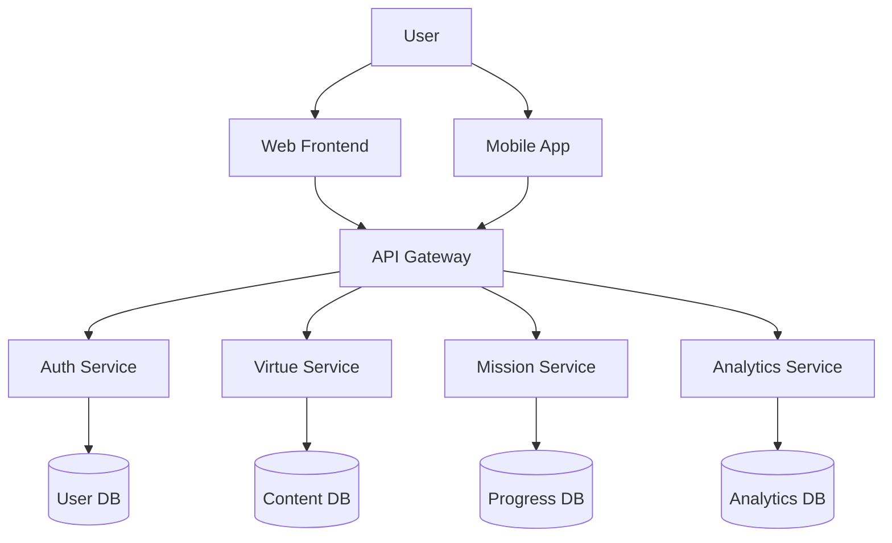

"Intellect and Ignorance are two armies at war within the human heart."
— Hadith from Usul al-Kafi

📋 Table of Contents

· Features
· Installation
· Project Structure
· Architecture
· API Documentation
· Development Setup
· Testing
· Deployment
· Contributing
· License
· Acknowledgments

✨ Features

🎮 Gamification System

· Virtue-Vice Pair Matching: 75 paired character traits
· Progression Levels: 3-tier system (Novice, Intermediate, Advanced)
· Daily Missions: Context-aware ethical challenges
· Achievement System: Badges, ranks, and rewards

🧠 Multi-Modal Learning

· Physical Kit: Magnetic blocks, character cards
· Digital Platform: AR mobile app, web dashboard
· Social Events: Seasonal festivals, family groups

📱 Tech Stack

· Backend: Python/FastAPI with MongoDB
· Frontend: React/Next.js with TypeScript
· Mobile: React Native with AR capabilities
· DevOps: Docker, Kubernetes, CI/CD pipeline

🚀 Installation

Prerequisites

· Python 3.8+
· Node.js 16+
· MongoDB 5.0+
· Docker (optional)

Quick Start

```bash
# Clone the repository
git clone https://github.com/yourusername/ghaleb-e-ghalb.git
cd ghaleb-e-ghalb

# Backend setup
cd backend
python -m venv venv
source venv/bin/activate  # On Windows: venv\Scripts\activate
pip install -r requirements.txt

# Environment configuration
cp .env.example .env
# Edit .env with your settings

# Initialize database
python scripts/init_db.py

# Frontend setup
cd ../frontend
npm install

# Run development servers
# Terminal 1: Backend
cd backend && uvicorn main:app --reload

# Terminal 2: Frontend
cd frontend && npm run dev

# Terminal 3: Mobile (optional)
cd mobile && npm start
```

Docker Deployment

```bash
# Using Docker Compose
docker-compose up -d

# Or with Docker
docker build -t ghaleb-e-ghalb .
docker run -p 8000:8000 ghaleb-e-ghalb
```

📁 Project Structure

```
ghaleb-e-ghalb/
├── backend/
│   ├── app/
│   │   ├── api/              # API endpoints
│   │   │   ├── v1/
│   │   │   │   ├── users.py
│   │   │   │   ├── virtues.py
│   │   │   │   └── missions.py
│   │   ├── core/             # Core functionality
│   │   │   ├── config.py
│   │   │   ├── security.py
│   │   │   └── database.py
│   │   ├── models/           # Database models
│   │   ├── schemas/          # Pydantic schemas
│   │   └── services/         # Business logic
│   ├── tests/
│   ├── alembic/              # Database migrations
│   └── requirements.txt
├── frontend/
│   ├── src/
│   │   ├── components/       # React components
│   │   ├── pages/           # Next.js pages
│   │   ├── hooks/           # Custom React hooks
│   │   ├── utils/           # Utility functions
│   │   └── styles/          # CSS/SCSS styles
│   └── package.json
├── mobile/
│   ├── src/
│   │   ├── screens/         # App screens
│   │   ├── components/      # Shared components
│   │   ├── navigation/      # Navigation setup
│   │   └── ar/             # AR functionality
│   └── package.json
├── shared/
│   ├── types/              # TypeScript definitions
│   └── constants/          # Shared constants
├── docs/
├── scripts/
├── docker-compose.yml
└── README.md
```

🏗️ Architecture

System Design



Database Schema

```sql
-- Core tables
CREATE TABLE virtues (
    id UUID PRIMARY KEY,
    name VARCHAR(100),
    description TEXT,
    opposite_vice_id UUID,
    icon_url VARCHAR(500),
    color_code VARCHAR(7)
);

CREATE TABLE users (
    id UUID PRIMARY KEY,
    username VARCHAR(50) UNIQUE,
    email VARCHAR(100) UNIQUE,
    age_group VARCHAR(20),
    current_level INTEGER,
    total_points INTEGER
);

CREATE TABLE missions (
    id UUID PRIMARY KEY,
    title VARCHAR(200),
    description TEXT,
    virtue_id UUID,
    difficulty VARCHAR(20),
    duration_minutes INTEGER
);
```

📚 API Documentation

Base URL

```
https://api.ghaleb-e-ghalb.ir/v1
```

Key Endpoints

```http
# Authentication
POST /auth/register
POST /auth/login
POST /auth/refresh

# Virtue Management
GET /virtues
GET /virtues/{id}
POST /virtues/progress

# Mission System
GET /missions/daily
POST /missions/{id}/complete
GET /missions/history

# User Progress
GET /users/{id}/progress
GET /users/{id}/achievements
```

Example Request

```python
import requests

# Get daily missions
response = requests.get(
    "https://api.ghaleb-e-ghalb.ir/v1/missions/daily",
    headers={"Authorization": "Bearer YOUR_TOKEN"}
)

# Complete a mission
requests.post(
    "https://api.ghaleb-e-ghalb.ir/v1/missions/123/complete",
    json={"notes": "Successfully practiced patience"},
    headers={"Authorization": "Bearer YOUR_TOKEN"}
)
```

💻 Development Setup

Environment Variables

```bash
# Backend .env
DATABASE_URL=mongodb://localhost:27017/ghaleb_ghalb
SECRET_KEY=your-secret-key-here
ALGORITHM=HS256
ACCESS_TOKEN_EXPIRE_MINUTES=30
REDIS_URL=redis://localhost:6379

# Frontend .env.local
NEXT_PUBLIC_API_URL=http://localhost:8000
NEXT_PUBLIC_WS_URL=ws://localhost:8000
```

Code Quality

```bash
# Backend linting and formatting
cd backend
black app/
flake8 app/
mypy app/

# Frontend linting
cd frontend
npm run lint
npm run format

# Run tests
pytest backend/tests/ -v
npm test frontend/
```

Database Migrations

```bash
cd backend
alembic revision --autogenerate -m "Description"
alembic upgrade head
```

🧪 Testing

Test Structure

```python
# Example test for virtue matching
def test_virtue_vice_matching():
    virtue = Virtue(name="Patience", description="Enduring hardship")
    vice = Vice(name="Impatience", description="Inability to wait")
    
    assert virtue.opposite_id == vice.id
    assert vice.opposite_id == virtue.id

# Integration test
def test_complete_mission_flow():
    user = create_test_user()
    mission = create_test_mission()
    
    response = complete_mission(user, mission)
    assert response.status_code == 200
    assert user.points_increased()
```

Running Tests

```bash
# Run all tests
pytest backend/tests/ -v

# Run specific test module
pytest backend/tests/test_virtues.py

# With coverage report
pytest --cov=app backend/tests/

# Frontend tests
cd frontend && npm test
```

🚢 Deployment

Production Setup

```bash
# Build Docker images
docker-compose -f docker-compose.prod.yml build

# Deploy with Kubernetes
kubectl apply -f k8s/

# Database backup
mongodump --uri=mongodb://production-db --out=/backups/
```

Monitoring

```bash
# Check logs
docker-compose logs -f

# Health check
curl https://api.ghaleb-e-ghalb.ir/health

# Performance monitoring
docker stats
```

🤝 Contributing

We welcome contributions! Please see our Contributing Guide for details.

Development Workflow

1. Fork the repository
2. Create a feature branch
3. Make your changes
4. Add tests
5. Submit a pull request

Code Style

```python
# Follow PEP 8
def calculate_virtue_score(user: User, virtue: Virtue) -> float:
    """
    Calculate user's score for a specific virtue.
    
    Args:
        user: User object
        virtue: Virtue object
    
    Returns:
        Score between 0 and 100
    """
    # Implementation here
```

📄 License

This project is licensed under the GNU General Public License v3.0 - see the LICENSE file for details.

🙏 Acknowledgments

· Based on Hadith from Usul al-Kafi
· Inspired by positive psychology research
· Built with modern software engineering practices
· Supported by educational psychology experts

📞 Contact

· Website: ghaleb-e-ghalb.ir
· Email: contact@ghaleb-e-ghalb.ir
· Discord: Join our community

📊 Project Status

Component Status Version
Backend API ✅ Production Ready 1.0.0
Web Dashboard ✅ Beta 0.9.0
Mobile App 🚧 In Development 0.5.0
AR Features 🚧 In Development 0.3.0
Content Library ✅ Complete 1.0.0

---

<div align="center">

Built with ❤️ for ethical education

https://api.star-history.com/svg?repos=yourusername/ghaleb-e-ghalb&type=Date

</div>
